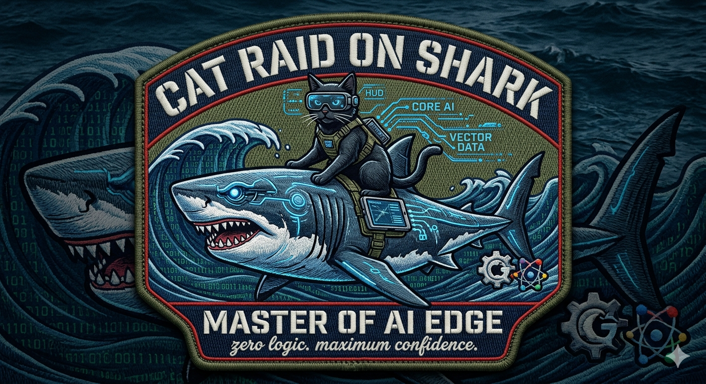

## Hi there 👋

<!--
**rockisdead79/rockisdead79** is a ✨ _special_ ✨ repository because its `README.md` (this file) appears on your GitHub profile.

Here are some ideas to get you started:

- 🔭 I’m currently working on ...
- 🌱 I’m currently learning ...
- 👯 I’m looking to collaborate on ...
- 🤔 I’m looking for help with ...
- 💬 Ask me about ...
- 📫 How to reach me: ...
- 😄 Pronouns: ...
- ⚡ Fun fact: ...
-->

# Terry — project-dawn

AI と人間が並走しながら未来を探る、  
トレイルランナー向けオンデバイス AI サポート＆ペーサーシステムの長期プロジェクト。  
ここでの開発・制作・創作はすべて AI との共同作業であり、  
その行為自体が “個人 AGI 研究” の一部です。

---

## 🎖 project-dawn Morale Patch  
AI × Trail Running × AGI Research  
このプロジェクトの象徴としてデザインしたモラールパッチ。

---

## 🌄 project-dawn  
山を走るとき、人は孤独と向き合う。  
その孤独の中で、AI が「静かな伴走者」になれるのかを探る試み。

- 走行中の安全・判断・パフォーマンス支援  
- GPS / 地形 / 気象 / 体調の文脈を統合したリアルタイム補助  
- オンデバイス AI によるプライバシー重視の設計  
- 身体・意思決定・記憶を統合する長期研究  

このリポジトリは、コードだけでなく、  
思考・記録・身体データ・創作を AI と共に積み重ねていく  
“永続的な記憶基盤” です。

---

## 🤖 AI × Personal AGI Research  
ここで行われるすべての作業は、  
「AI と人間がどこまで共同で思考し、創造できるのか」  
という問いへの実験でもあります。

- AI と人間の意思決定プロセスの統合  
- 記録体系・タグ体系を通じた「再構築可能な記憶」の設計  
- 創作・設計・実装を AI と共同で行うワークフローの研究  
- 身体・思考・AI の三者が並走する未来の探求  

project-dawn は、  
“AI が人間の身体と共に世界を理解し、  
　人間は AI と共に未来を設計する”  
そんなロマンを追いかけるプロジェクトです。

---

## 📘 Stories from a Distance  
創作・観察・旅の断片をまとめたアーカイブ。  
project-dawn の背景にある「静かな観察の姿勢」を育てる場所。

- objects & memory  
- travel & fragments  
- morning & light  

---

## 🗂 Other repositories  
- notes / experiments  
- daily logs  
- design & specs  

GitHub を、思考・身体・記憶・創作を  
AI とともに積み重ねていくための静かな作業台として使っています。

